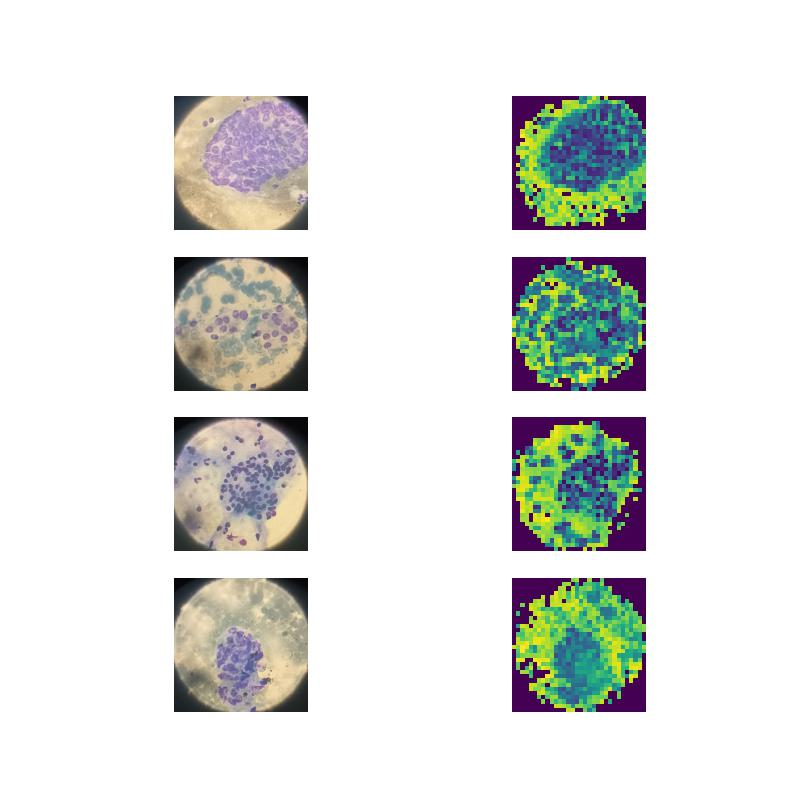

Please refer to [this post](https://junukcha.github.io/code/2023/12/31/dinov2-pca-visualization/).

## Install
Run `source scripts/install.sh`.

## Visualization of the PCA
Run `python main.py`.

The Figure 1 of DINOv2 [paper](https://arxiv.org/pdf/2304.07193.pdf).

The results of Figure 1 are reproduced below.
### Dog

### NOH data 
From top to bottom: #25 cancer, #70 cancer, #81 benign, #92 cancer

### NOH data 2
From top to bottom: #10 cancer, #22 benign, #35 benign, #48 cancer

